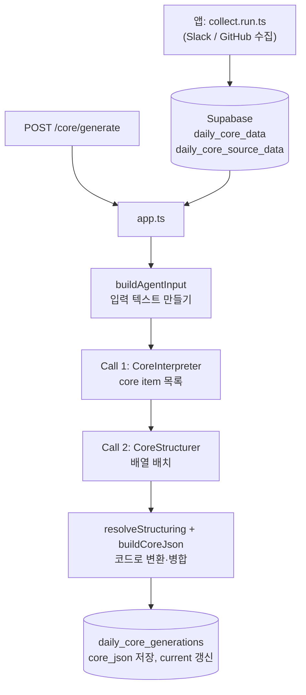

# ieum-flue

Daily Core를 생성하는 Cloudflare Worker입니다. Flue(`@flue/runtime`) 런타임 위에서 Agent 두 개를 순서대로 호출합니다. 호출 순서는 코드가 정하고, 모델은 각 단계 안에서 판단만 합니다. 수집은 앱(Vercel) 쪽이 하고, 이 Worker는 수집된 데이터를 읽어 Core를 만들고 저장합니다.

## 전체 흐름



| 단계 | 누가 | 하는 일 |
|---|---|---|
| 0. 수집 | 앱 `app/features/daily-core/collect.run.ts` | Slack과 GitHub를 날짜 창 기준으로 모아 정규화하고 `daily_core_source_data.normalized_json`에 저장 |
| 1. 읽기 | `app.ts` | Supabase REST(service role 키)로 `daily_core_data`와 수집 행을 읽음 |
| 2. 입력 만들기 | `buildAgentInput` (코드) | 스레드를 묶고, 날짜 창 이전의 부모는 `(context)`로 표시, 봇 알림은 뺌(답글이 있는 부모는 유지). 각 줄에 ref(`S001`…)를 붙이고, ref별 작성자 표와 사람 목록을 만듦 |
| 3. generation 행 생성 | `app.ts` | `processing` 상태로 만들고 파이프라인·프롬프트 버전, 모델, 입력 행 id를 기록 |
| 4. Call 1 | `CoreInterpreter` (모델) | 하루를 사건 단위 core item으로 묶음 |
| 5. Call 2 | `CoreStructurer` (모델) | core item을 highlights / topics / progress_roadmap / member_activity에 배치하고 overview를 씀 |
| 6. 변환·병합 | `resolveStructuring`, `buildCoreJson` (코드) | core item id를 근거 ref로 바꾸고(멤버는 본인이 쓴 줄만) importance, tags 등을 core item에서 채움. ref를 원본 항목(id, 시각, url)으로 바꾸고 meta, metrics, quality를 붙임 |
| 7. 저장 | `app.ts` | `core_json`, 단계별 원출력, 토큰, 시간, 반려 이유, stats를 저장하고 `succeeded`와 current를 갱신. 실패하면 `failed`로 남기고 current는 그대로 |

## Agent

두 Agent 모두 할 수 있는 일은 제출 Tool 하나뿐입니다. 제출 Tool의 입력 스키마가 곧 출력 계약입니다. Tool의 `run`이 코드 검사를 하고, 문제가 있으면 이유와 함께 반려합니다. 모델은 같은 대화 안에서 고쳐 다시 제출합니다.

| | `CoreInterpreter` (Call 1) | `CoreStructurer` (Call 2) |
|---|---|---|
| 파일 | `src/agents/core-interpreter.ts` | `src/agents/core-structurer.ts` |
| 입력 | 텍스트로 바꾼 하루 활동 + 오늘 글을 쓴 사람 목록 | Call 1 결과에서 추린 JSON(core item, members, people). evidence ref는 넣지 않음 |
| 제출 Tool | `submit_interpretation` (스키마 `Interpretation`) | `submit_daily_core` (스키마 `Structuring`) |
| 반려하는 문제 | 없는 ref, 맥락 줄만 인용, 봇 줄만 인용, concept_key 중복 | 모르는 core item id, 한 core item을 여러 곳에 배치, 사람 목록에 없는 멤버, 본인 줄이 없는 멤버, 같은 사람 중복 |
| 반려 대신 코드가 고치는 것 | 인용한 줄을 쓰지 않은 멤버 actor 제거(`dropUnwrittenActors`) | 없음 |
| 결과 | `useDataWriter("interpretation")` | `useDataWriter("structuring")` |

모델 기본값은 `app.ts`의 `DAILY_CORE_MODEL`이고, 추론 강도는 각 Agent의 `useModel(..., { thinkingLevel })`에 있습니다. 지시문 버전은 각 Agent 파일의 `*_PROMPT_VERSION`, 파이프라인 버전은 `app.ts`의 `PIPELINE_VERSION`이며 generation 행에 기록됩니다.

반려는 재제출마다 모델이 JSON 전체를 다시 내므로 비용이 큽니다. 그래서 `runAgent`가 스트림의 반려(`tool-output-error`, 스키마 실패 포함)를 세다가 `MAX_REJECTIONS`에 이르면 `handle.abort()`로 멈춥니다. 이 경우 generation은 `failed`가 됩니다.

## 파일

| 파일 | 역할 |
|---|---|
| `src/app.ts` | Hono 라우트, 인증, Supabase 읽기·쓰기, Agent 실행 순서 |
| `src/daily-core.ts` | 모델 바깥의 규칙: 입력 만들기, 스키마, 검사, 보정, 변환, `core_json` 병합, 지표 |
| `src/daily-core.check.ts` | 위 규칙의 assert 테스트. 모델 없이 돌아감 |
| `src/agents/*.ts` | Agent 지시문과 제출 Tool 연결 |
| `wrangler.jsonc` | Worker 설정과 Durable Object migration(Agent 추가·삭제마다 한 줄) |

## 사용하는 Flue 기능

| 기능 | 쓰는 곳 |
|---|---|
| `"use agent"` + Agent 함수 | Agent 하나가 Durable Object 클래스 하나(`Flue<Name>Agent`)가 됨 |
| `useModel(model, { thinkingLevel })` | 모델과 추론 강도 |
| `useInitialData` | 검사에 필요한 데이터(ref 목록, 작성자 표 등) 전달 |
| `useTool` (Valibot 스키마) | 제출 Tool. 스키마 검증 실패는 `run`까지 오지 않고 바로 반려됨 |
| `useDataWriter` | 검사를 통과한 결과를 구조화 데이터로 꺼냄 |
| `useAgentFinish` | 제출 없이 끝내려 하면 제출하라는 신호를 넣음 |
| `useResponseFinish` | 토큰 사용량과 Tool 호출 기록을 메타데이터로 남김 |
| `init` → `dispatch` → `read(onEvent)` | `app.ts`에서 Agent 실행, 반려 이유 수집, 상한 초과 시 `abort()` |
| `createAgentRouter` | `/agents/test` 노출 |

Skill, Subagent, MCP, Sandbox, 데이터 조회 Tool, Workers AI 바인딩은 쓰지 않습니다. 언제 검토할지는 `works/` 아래 TODO(Skill / Subagent 필요 여부, 모델 교체 비교)에 적혀 있습니다.

## 엔드포인트

| 경로 | 내용 |
|---|---|
| `GET /` | 헬스 체크 |
| `POST /core/generate` | 본문 `{ dailyCoreId, model? }`. Bearer 토큰(`FLUE_API_TOKEN`) 필요. 응답에 stats, 토큰, 호출별 시간·반려 이유, `coreJson` |
| `/agents/test/*` | `TestAgent`(한 문장 생성). 앱의 메일 발송 경로(`app/features/cron/api/create-contents.tsx`)가 사용 |

## 실행과 배포

```sh
npm run dev                            # 로컬 Worker, http://localhost:8787
npx tsx src/daily-core.check.ts        # 규칙 테스트 (flue/ 에서)
npx tsc --noEmit -p .                  # 타입 검사
npm run deploy                         # vite build + wrangler deploy
```

- 로컬 시크릿은 `.dev.vars`: `OPENAI_API_KEY`, `FLUE_API_TOKEN`, `SUPABASE_URL`, `SUPABASE_SERVICE_ROLE_KEY`. 배포용 `CLOUDFLARE_API_TOKEN`, `CLOUDFLARE_ACCOUNT_ID`도 여기 둠.
- 배포본 시크릿은 `wrangler secret put`으로 등록. 배포 방법은 `works/env.md`.
- 모델 제공자 키는 Flue가 환경변수에서 찾음(`openai/...` → `OPENAI_API_KEY`). 코드에서 넘기지 않음.
- Agent를 추가·삭제하면 `wrangler.jsonc` migrations에 `new_sqlite_classes` / `deleted_classes`를 한 줄 추가.

## 아직 연결되지 않은 것

- 수집부터 생성까지 매일 자동으로 도는 Cron. 지금은 수집(`collect.run.ts`)도 생성(`/core/generate`)도 수동.
- `core_json`을 `daily_core_items`, `daily_core_metrics` 테이블로 푸는 projection.
- Daily Core를 읽어 리포트를 만드는 Daily Report.
- Supabase 쓰기는 REST로 순서대로 함(트랜잭션 없음). 중간에 죽으면 generation이 `processing`으로 남음.
